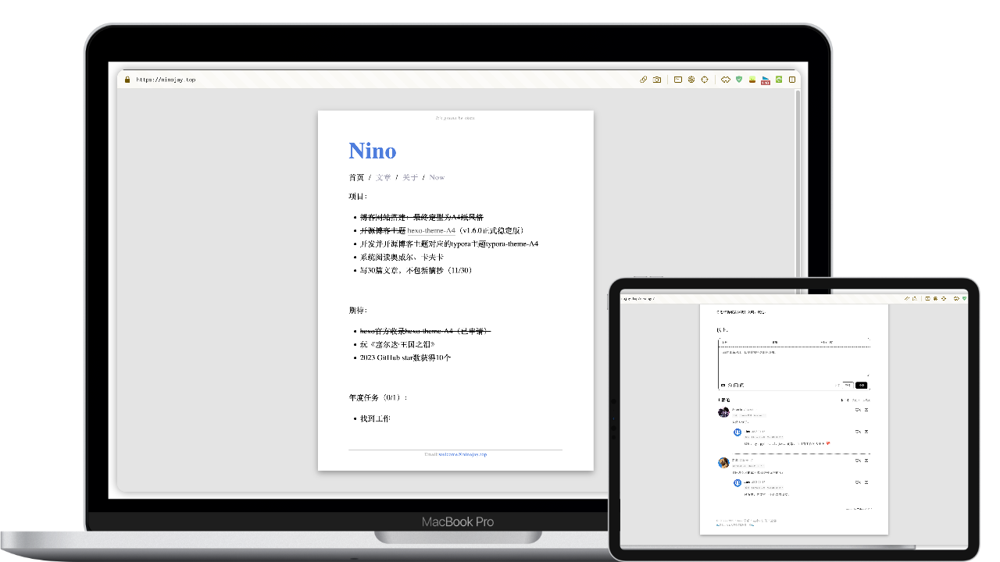
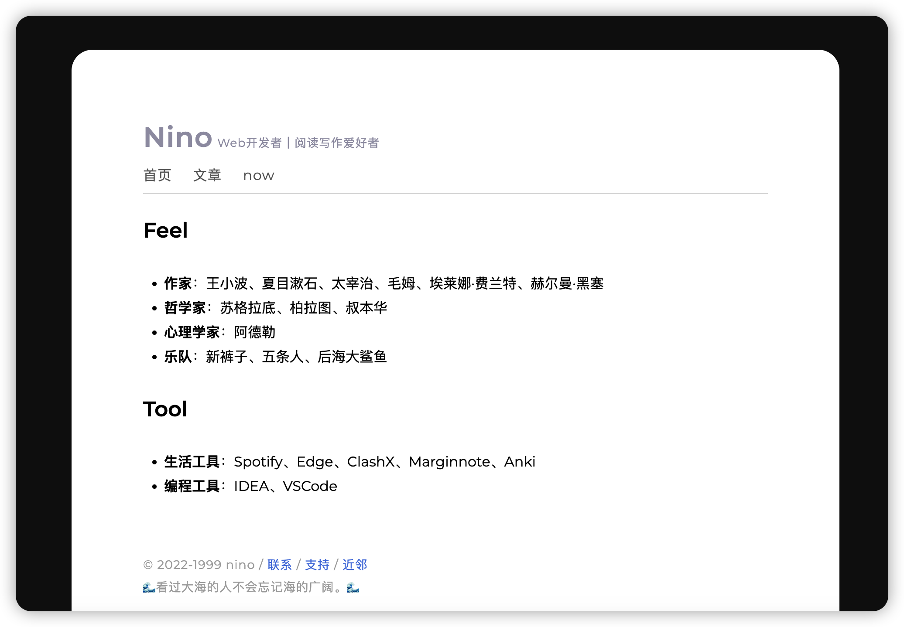
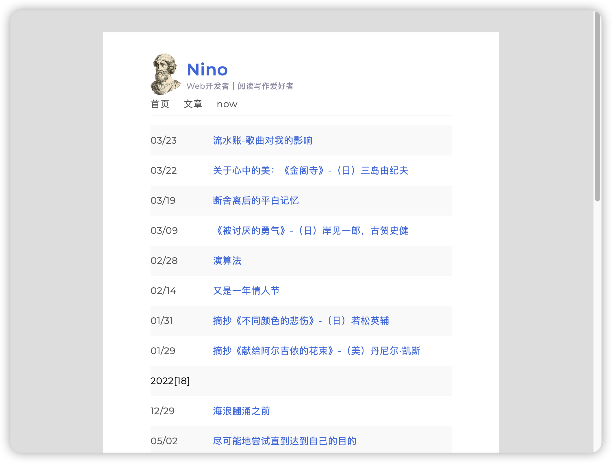
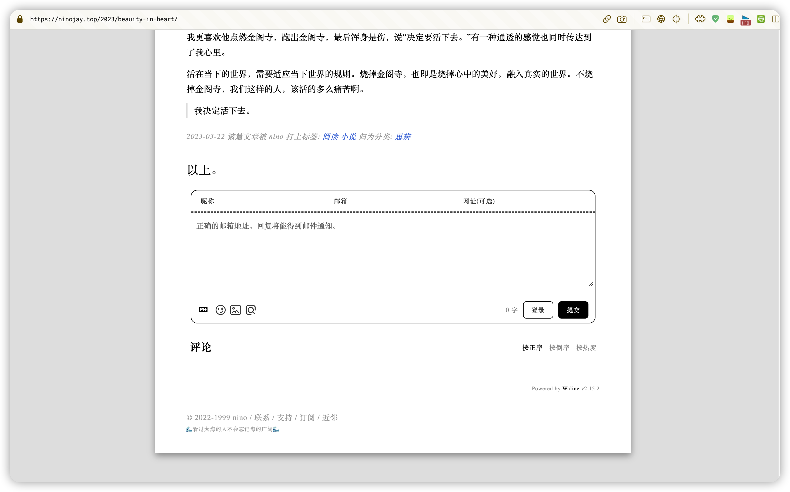

# hexo-theme-A4

<div align="right">
  <a title="zh-CN" href="https://github.com/HiNinoJay/hexo-theme-A4"> </a>
  <a title="EN" href="README-EN.md">  </a>
  <a title="zh-TW" href="README_zh-TW.md"></a>
</div>

<div align="center" >
<a href="https://ninojay.top">

</a>
</div>

<div align="center">

Welcome to the A4!<br/>
A4 is a simple, lightweight and elegant theme for Hexo.<br/>
With minimal configuration, achieve a paper-like appearance resembling A4 size.<br/>


[]()
[](https://hexo.io/zh-cn/index.html)
[](https://nodejs.org/en)

Let the readers focus on reading the text, while the writers concentrate on writing.
➡️ [Demo](https://ninojay.top) ➡️ [Docs](https://doc.ninojay.top)<br/>

_A star in the top right corner for faster feature updates_

</div>


[](https://github.com/HiNinoJay/hexo-theme-A4)

## 🏹️Features

- [x] Basic functions of blog: archive/tag/category/index
- [x] With the paper-like index page, content is up to you
- [x] Footer and Header of pages can be customized
- [x] Pages can be individually configured with the following functions：hidded page, comment module, top articles, [Mathjax support for Math writting](https://ninojay.top/hexoplugin/hexo-filter-mathjax/), [encrypted access](https://ninojay.top/hexoplugin/hexo-blog-encrypt/)
- [x] [**Easily customized global color schemes, preview of two color schemes**](https://ninojay.top/hexoplugin/A4-color-change/)
- [x] Adopt the most beautiful comment module `waline`
- [x] Preset css styles that can be used by Markdown
- [x] [Supported hexo plugins](https://ninojay.top/tags/hexoPlugin/)
  - [x] [mathjax](https://ninojay.top/hexoplugin/hexo-filter-mathjax/)
  - [x] [encrypt](https://ninojay.top/hexoplugin/hexo-blog-encrypt/)
  - [x] [github-emojis language support](https://ninojay.top/hexoplugin/hexo-filter-github-emojis/) 
  - [x] [markdown footnotes support](https://ninojay.top/hexoplugin/hexo-reference/) 
  - [x] [minifier which can compress website images/css/js and other resources](https://ninojay.top/hexoplugin/hexo-all-minifier/) 

## 🔥Demonstration

### Various Color Scheme

#### Grey and white color scheme (Default)


#### Green and gold color scheme (Pre-provided | One-click activation)


Color coordination is an art. In addition to the two color schemes recommended for A4, I can also create my own color palettes and share them with everyone. If you would like to explore more color combinations, please refer to the following link: [Preview](https://ninojay.top/hexoplugin/A4-color-change/).

### Index



### Page List



### Tags And Category



### Comments


## 👋How To Use

- make sure you have been created folder by `hexo init`, for convenience, suppose the name of the folder is `website`
- navigate to the `website` by using the command line
- set the theme to A4 in the `_config.yml` file under the `website` folder
- install `a4 theme` next by any one of two methods below:

### By npm (Recommended)
- execute `npm install hexo-theme-a4@latest`
- create the `_config.a4.yml` file under the `website` folder，copy [the content here](https://github.com/HiNinoJay/hexo-theme-A4/blob/main/_config.yml) into it
- all personalized configurations for the theme will be performed in the `_config.a4.yml` file, which can be configured according to the comments in the file
- execute `hexo s` to take a look of preview

### By git
- execute `git clone git@github.com:HiNinoJay/hexo-theme-A4.git themes/A4`
- create the `_config.a4.yml` file under the `website` folder，copy [the content here](https://github.com/HiNinoJay/hexo-theme-A4/blob/main/_config.yml) into it
- all personalized configurations for the theme will be performed in the `_config.a4.yml` file, which can be configured according to the comments in the file
- execute `hexo s` to take a look of preview

## ⚠️Configuration (Required!)

The homepage and article list pages need to be manually generated, just execute the following commands:
```shell
hexo new page index
hexo new page list
```

For other detailed configurations, please see:
➡️ [Online usage manual](https://doc.ninojay.top)

## ⬆️ How to update
According to your `install` method，choose the `corresponding` way to update.

### by npm

Navigate to the root directory of your blog site by using the command line
Excuting order below:

```shell
npm install hexo-theme-a4@latest
```

### by git
Navigate to the directory `themes/A4` by using the command line
Excuting order below:

```shell
git pull
```
---

### Notice
After updating through the above two methods, please visit the [GitHub page](https://github.com/HiNinoJay/hexo-theme-A4/releases) to check the latest version. I will indicate whether there are any additions or modifications to the configuration file.

If there are any modification, you need to copy the corresponding additions or modifications from the [latest file](https://github.com/HiNinoJay/hexo-theme-A4/blob/main/_config.yml) and apply them to your `_config.a4.yml` file.

## ☕️ support

Welcome to submit pull request or issue, please submit to dev branch.

Anything else you want to communicate with, you can send an email to: welcome@ninojay.top

If you think I'm not doing too well, please give me a star for the project, or [buy me a cup of coffee ☕️](https://ninojay.top/supportbymoney/)

## 💗 feeling

Heartfelt thanks to A4 supporters: https://github.com/HiNinoJay/hexo-theme-A4/blob/main/DONATION.md


## Stargazers over time

[](https://starchart.cc/HiNinoJay/hexo-theme-A4)

